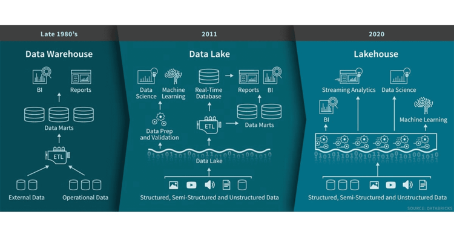
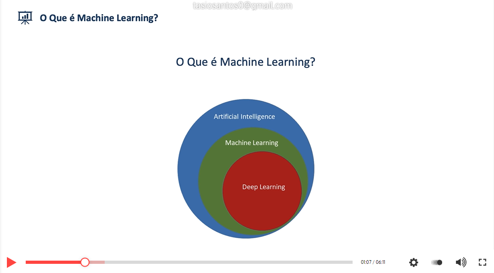

# Big data

# Oque e Big data ?

Big data é a área do conhecimento que estuda como tratar, analisar e obter informações a partir de conjuntos de dados grandes demais para serem analisados por sistemas tradicionais

# Os 4 V's do big data

Os 4 V's do big data sao a base para qualquer projeto na area de dados abaixo eles estao explicados com mais detalahes

- Velocidade
  Hoje em dia a velocidade de coleta e de analiese desses dados e imprensidivel pois as decisoes sao tomadas em questao de momentos pelos gestores
- Variedades

  A variedade tambem e muito importante pois nao so de um banco nao relacional vai vir os dados hj em dia tudo e considerado um indicativo para avaliar e tomar decisoes

- Volume

  Conforme vai passando o tempo o volume aumenta de forma consideravel e escalonavel com todas as formas de coleta e formas de analiese

- Veracidade

  E emprensindivel que os dados passem uma verdadde ao gestor para ele tomar a descisoes precisas com um fundamento base muitp forte por isso a importancia de testes antes de implementar qualquer dashboard ou modelo de analise

# Tipo de banco de dados

## Banco de dados RELACIONAIS

- bancos de dados relacionais sao compostos por `esquemas` e sao muito bem estruturados
- Sao a base dos `DW` Tradicionais que comportam a maior parte dos sistemas internos da empresa como `CRM`

Examplos desses bancos sao:

- postgres
- mysql
- oracle

## Banco de dados NAO RELACIONAIS

- Um banco de dados não relacional é um banco de dados que não usa o esquema de tabela de linhas e colunas encontrado na maioria dos sistemas de banco de dados tradicionais.E armazena qualquer tipo de arquivo em varios formatos diferentas
- Com eles sao formados os modelos de `DL`,`DS`,`DM`,`DH`

Examplos desses bancos sao:

- firebase
- cassandra
- mongodb

# Armazenamento Hibrido

## Modelos de arquitetura de dados

`data lake`

`data hub`

`data lakehause`

`data layer`

`data storage`

# Armazenamento e Processamento (Cluster)

Um cluster consiste em computadores fracamente ou fortemente ligados que trabalham em conjunto, de modo que, em muitos aspectos, podem ser considerados como um único sistema.

> Processamento

- Processamento paralelo é uma forma mais eficiente de trabalhar informações, ele tem ênfase na exploração de eventos simultâneos na execução de um programa. Na prática, consiste no uso simultâneo de várias unidades de processamento (CPUs) para realizar trabalhos computacionais.

> Armazenamento

- processar grandes volumes de dados em paralelo, dividindo o trabalho em um conjunto de tarefas independentes.

> Ferramentas

Em resumo processamento paralelo é um método da área da computação que permite que dois (ou mais) processadores de um computador sejam usados para trabalhar em partes separadas de uma tarefa. Dessa forma, é possível diminuir o tempo gasto na resolução do problema.

As ferramentas mais recomendadas sao a do ecossistema Hadoop e a que que tera como foco

- Hadoop
- spark
- Airflow

_Roadmap Hadoop_

_Ecossistema Hadoop_

# Cloud computing

- Computação em nuvem é um termo coloquial para a disponibilidade sob demanda de recursos do sistema de computador, especialmente armazenamento de dados e capacidade de computação, sem o gerenciamento ativo direto do utilizador

- Arquitetura de nuvem é a forma como os componentes de tecnologia se combinam para criar uma nuvem, na qual os recursos são agrupados pela tecnologia de virtualização e compartilhados em uma rede.

# MlOps E DataOps

O Conceito de MlOps E DataOps é a combinação de filosofias culturais, práticas e ferramentas que aumentam a capacidade de uma empresa de distribuir aplicativos e serviços em alta velocidade: otimizando e aperfeiçoando produtos em um ritmo mais rápido do que o das empresas que usam processos tradicionais de desenvolvimento de software e analise de dados big data

## MLOps

MLOps ou ML Ops é um conjunto de práticas que visa implantar e manter modelos de machine learning em produção de forma confiável e eficiente. A palavra é um composto de "machine learning" e a prática de desenvolvimento contínuo de DevOps na área de software

## DataOps

DataOps é um conjunto de práticas, processos e tecnologias que combina uma perspectiva integrada e orientada a processos sobre dados com automação e métodos de engenharia de software ágil para melhorar a qualidade, velocidade e colaboração e promover uma cultura de melhoria contínua na área de análise de dados

## Cargos e funções de cada um nos modelos

- Arquiteto de dados
- Engenheiro de dados
- Engenheiro Machine learning
- Cientista de dados
- Analista de dados

# Daas (Data service para o futuro)

DaaS, oferece acesso on-line às bases de dados via interfaces JDBC ou ODBC, com controle de acesso e auditoria de uso. Nele estão disponíveis bases de governo hospedadas no Serpro - com a devida autorização do gestor, bem como bases de domínio público ou ainda outras sob demanda.

- A melhor forma de implementar um DaaS e por um Data layer que e um canal de saída centralizada para os dados
- API software de Integração

# ETL e ELT

_ETL_

ETL é um tipo de data integration em três etapas (extração, transformação, carregamento) usado para combinar dados de diversas fontes. Ele é comumente utilizado para construir um data warehouse

_ELT_

Extrair, carregar, transformar é uma alternativa para extrair, transformar, carregar usado com implementações de data lake. Ao contrário do ETL, nos modelos ELT, os dados não são transformados na entrada no data lake, mas armazenados em seu formato bruto original. Isso permite tempos de carregamento mais rápidos

## Alternativas em nuvem

- AWS glue

# Inteligencia artificial

## Oque e machine learning

O aprendizado automático ou a aprendizagem automática ou também aprendizado de máquina ou aprendizagem de máquina é um subcampo da Engenharia e da ciência da computação que evoluiu do estudo de reconhecimento de padrões e da teoria do aprendizado computacional em inteligência artificial.

## Modelos de pipeline

O Amazon ML aceita três tipos de modelos de ML: classificação binária, classificação multiclasse e regressão. O tipo de modelo que você deve escolher depende do tipo de destino que deseja prever.

## Etapas

1.Coleta de dados. Depois de determinar exatamente o que se deseja e quais serão os equipamentos utilizados, a primeira etapa do machine learning é a coleta de dados.

2.Preparação dos dados.

3.Escolha do modelo.

4.Treinamento.

5.Avaliação.

6.Aprimoramento dos parâmetros.

7.Predição.

## Pipeline

O foco de um pipeline de machine learning é dividir uma tarefa completa de machine learning em um fluxo de trabalho de várias etapas. Cada etapa é um componente gerenciável que pode ser desenvolvido, otimizado, configurado e automatizado individualmente. As etapas são conectadas por meio de interfaces bem definidas.

# Iniciar um projeto big data

- definição do business case
- planejamento odo projeto
- definição dod requisitos técnicos
- criação de um total business value assessment
